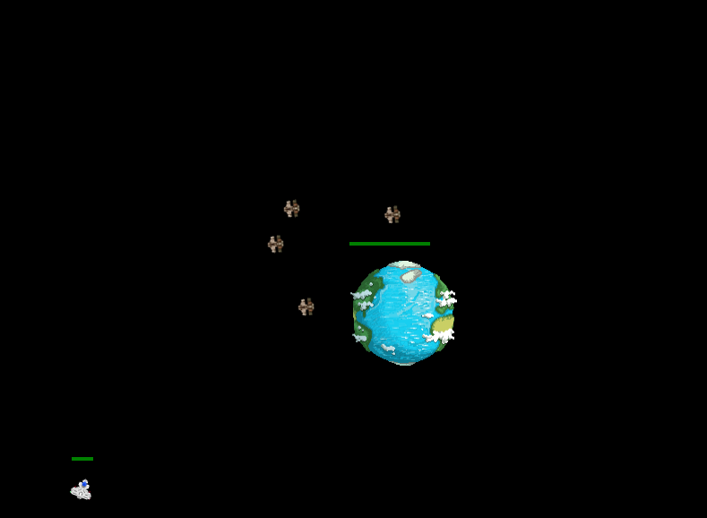

# WasteWars

## Backstory
The huge amount satellites and aerospatial debris already makes it hard to launch rockets, but what if they start crashing into Earth?
Your and your teammates' mission is to protected the planet by destroying those old satellites before they hit the surface.

## Really?
The story might be a little far-fetched and not so realistic, but the main point of that game was to have fun developing it, hoping that you will have as much fun playing it. And also that you may now be a little bit more aware of how crowded the geostationary orbit is.

## Usage
We sadly didn't have time to put a version online somewhere due to the many limitations of the actual game.
However, if you want to play it on your own machine/local network, follow the instructions below:

**Requirements**:
- [Node.js](nodejs.org)
- A static HTTP Server, like `python -m SimpleHTTPServer` (Python 2) or `python -m http.server` (Python 3)

```bash
$ npm install -g browserify noprob
$ git clone https://github.com/romac/wastewars
$ cd wastewars/server; npm install; node server.js &
$ cd ../client; python -m SimpleHTTPServer &
```

Then, open `http://YOUR-IP:8000` on your and your friends' computers, and play together!

## Screenshot


## Authors
- Dimiter Petrov
- Romain Ruetschi

WasteWars was developped for the 2013 [NASA Space Apps Challenge](http://spaceappschallenge.org/) during a continuous, 20 hours long, pair programming session.

## License
WasteWars is released under the [MIT license](http://opensource.org/licenses/MIT).